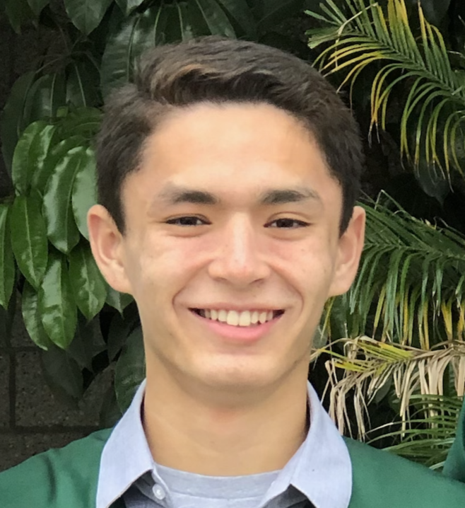

# Nicholas Willison's User Page


**Hello! I am _Nicholas Willison_, ~~the coolest guy ever~~, and this is my User Page.** This is my first time using markdown (which I learned from [documentation](https://docs.github.com/en/github/writing-on-github/basic-writing-and-formatting-syntax)), so I apologize if anything looks weird, but as my dad says,
> What is trying something new without any hiccups

Besides for this file (which I made on github's website) all other files in this repository were uploades using git commands, such as: 
```
git add
git commit
git push
```
You can see screenshots of these commands being performed [here](git.md).
## About Me
### As a Programmer
Currently, I am two quarters away from graduating with a Computer Science degree from UCSD.
I also have an internship lined up this summer with General Atomics. 
The programming languages I have learned, in order, are:
1. Java
2. C
3. C++
4. Python

My favorite programming language is C++ as I have done most course work in C++ it seems. 
I have not done any major projects, but I have dabbled in basic game development with [Unity](https://unity.com/). 
The reason I wanted to become a programmer in the first place was because I saw coding as a way to be both creative and logical at the same time. 
Code is like puzzle pieces that you must logically put together, but the outcome can be a creative masterpiece. 

### As a Person
My friends often describe me as: 
- Funny
- Smart
- Outgoing
- Ambitious
- Generous

I am a student at UCSD and work part-time at Best Buy. 
When I am not doing school work or actual work (which let's be honest, is rarely the case), I enjoy hanging out with my roommates, going to the beach, playing video games, or playing tennis. 
I actually spend a lot of time playing Super Smash Bros Ultimate with my roommate, Jake. 
Also, I currently am playing a lot of Pokémon; specifically doing a nuzlocke on Platinum (you can see my team [here](screenshots/team.png)). 
Back in high school, I was the captain of the tennis team, so playing tennis brings be back good memories, plus, I am decently good at it making it even more enjoyable.
The current goals in my life are to
- [x] Get an internship
- [ ] Get a car
- [ ] Graduate
- [ ] Get a job
